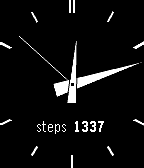

# simple-analog-health

Example analog watchface that uses hands instead of numbers and displays the step count from the [Pebble Health API](https://developer.getpebble.com/docs/c/preview/Foundation/Event_Service/HealthService/).
